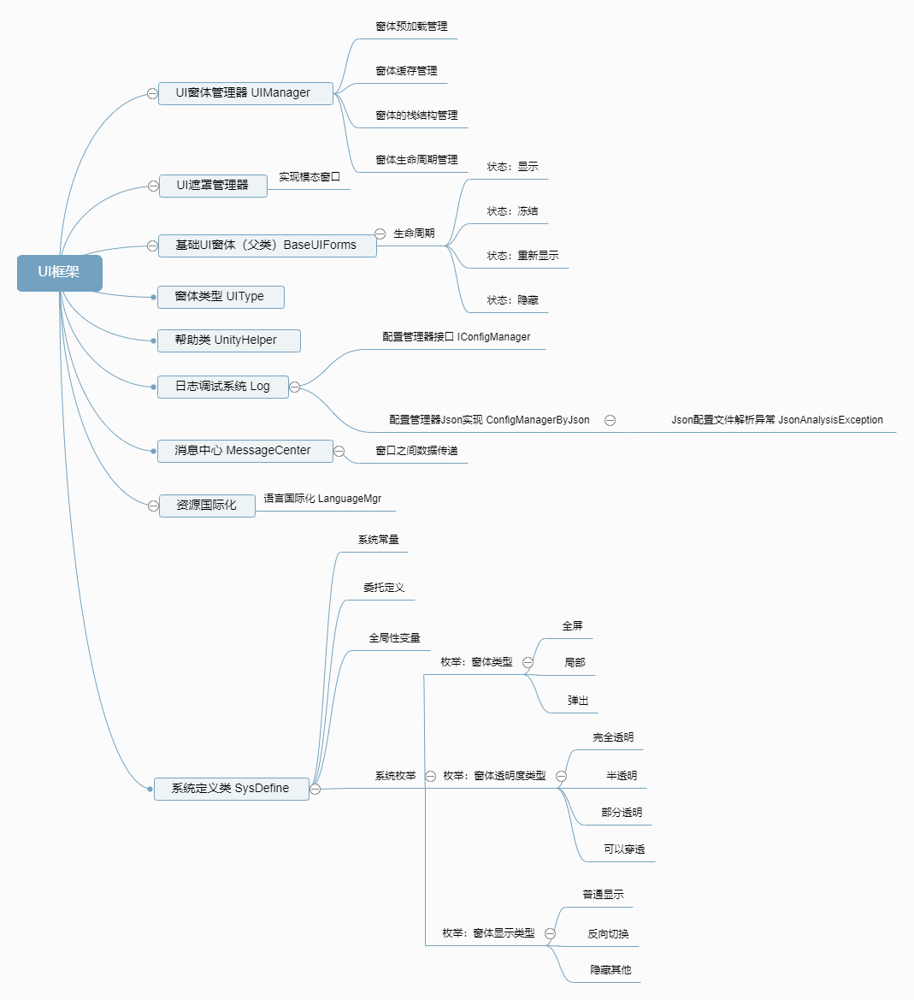
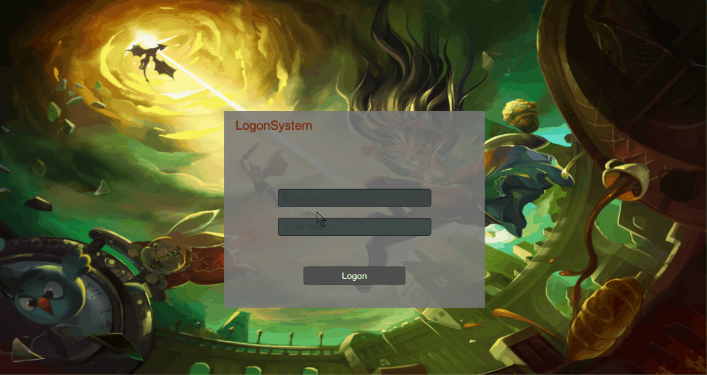
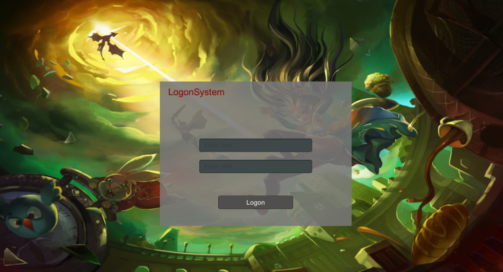
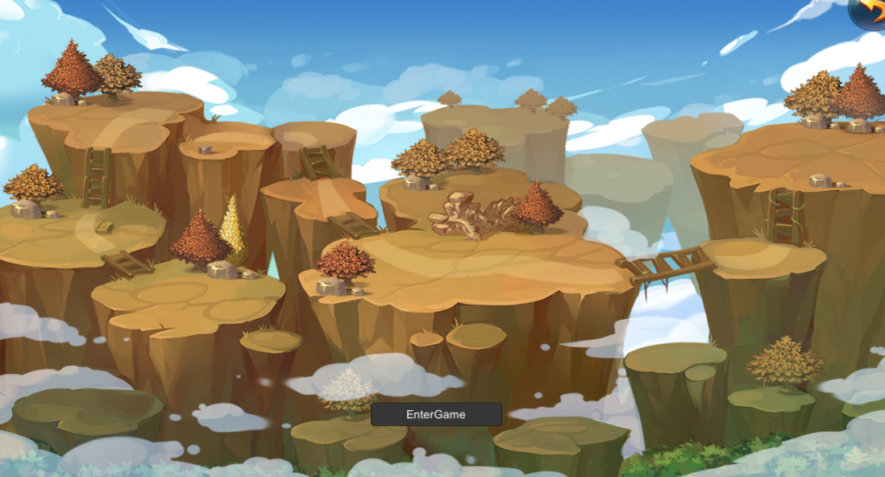
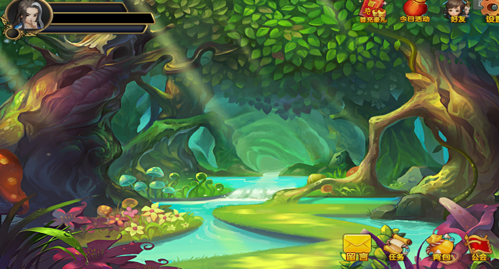
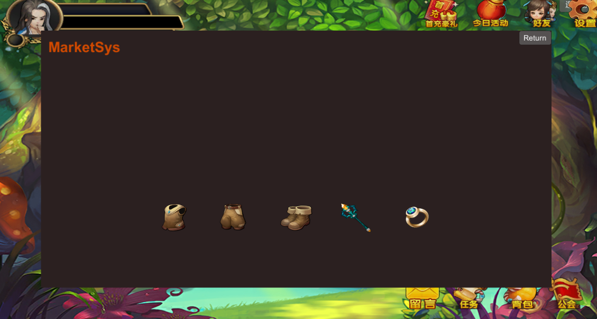
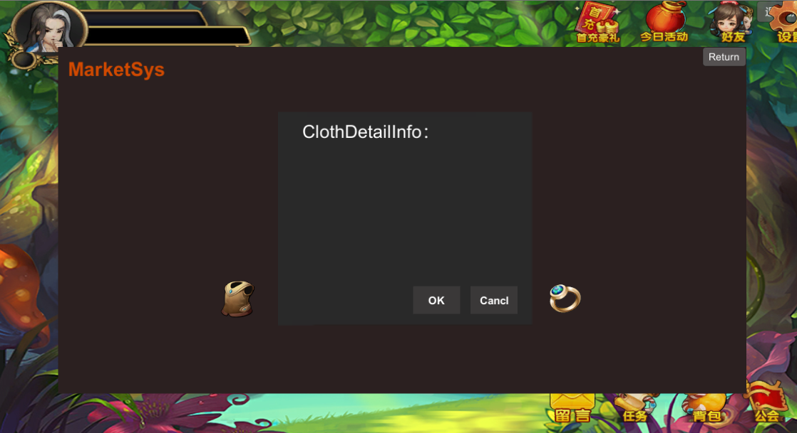
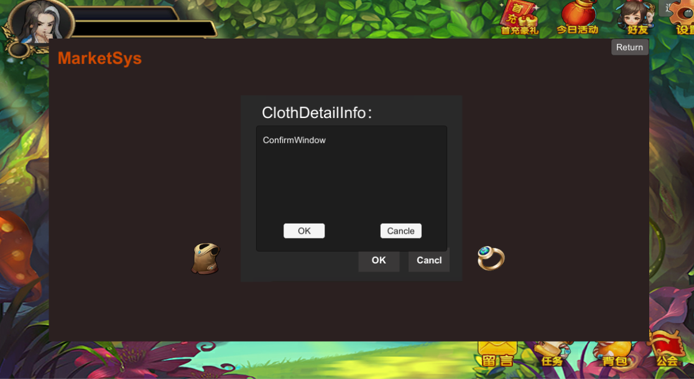

---
# SUIFW
-------------

> A simple UI framework built by Unity2018.  

## Framework


## Demo  



### Log On :


### Choose Character :


### Game Pannel :


### Store :


### Choose Goods And Show Detail Information :


### Confirm :



---
## Feature
- log on 

- choose character

- game pannel

- store

- choose goods 

- show detail information
 
- confirm   

---

## Usage

``` 
Use /Assets/Scripts/SUIFW/ to build your project.
```
---

## License

MIT LICENSE